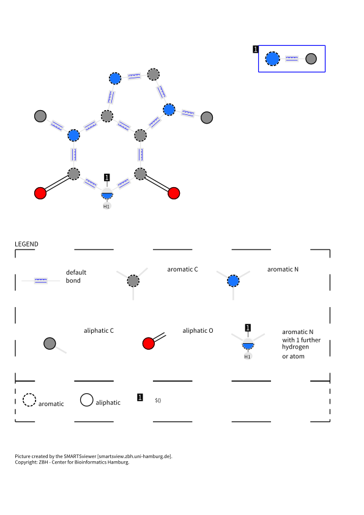

# 👀 smarts-explainer

SMARTS explainer is a small wrapper around the `[SMARTSview](https://smarts.plus/)` tool developped at ZBH U. Hamburg for creating an easy to comprehend visualization for SMARTS expression. The concept was developed K. Schomburg and M. Rarey.

## Installation
---

`smarts-explainer` requires `datamol` and `requests-toolbelt`. You can install it as follows
```shell
pip install smarts-explainer
```

Alternatively, download, install the dependency then install it with:

```shell
git clone git@github.com:maclandrol/smexplainer.git
cd smexplainer
mamba env create -f env.yml -n "smexplainer" && conda activate smexplainer
pip install -e . 
```
## Usage
---
```python

import smexplainer

my_smarts = "c12c(n(C)c(=O)[nH,$(nC)]c(=O)1)ncn2C"
smexplainer.explain(my_smarts, filetype="png")
```


For a batch of smarts, you can use the `smexplainer.batch_explain` function instead


### Input parameters:

- `smarts`: a smarts string (valid) to visualize
- `comparesmarts`: optional smarts to compare agains
- `vmode`: 	visualization Mode: 
  - 0 = Complete visualization (default)
  - 1 = ID-Mapping
  - 2 = Element symbols
  - 3 = Structure Diagram-Like
- `vbonds`: Visualization of Default Bonds
  - 0 = "Single bonds"
  - 1 = "Single or Aromatic Bonds" (default)
- `textdesc`: Legend Option 1: Textual desciption
  - False = No
  - True = Yes (default)
- `depsymbols`: Legend Option 2: Depiction of SMARTS symbols
  - False = No
  - True = Yes (default)
- `smartsheading`: Legend Option 3: Write SMARTS as picture heading
  - False = No
  - True = Yes (default)
- `trim`: SMARTS trim active:
  - False = No
  - True = Yes (default)
- `labels`: Show Atom Labels
  - False = No
  - True = Yes (default)
- `cmode`: Compare Mode: This only affects compare images
  - 1 = Search for Identical Patterns
  - 2 = Subset search from smarts
  - 3 = subset search from comparesmarts
  - 4 = Similarity Search (default)
- `detectarom`: Detect Aromatic Bonds
  - False = No
  - True = Yes (default)
- `smileslikearom`: SMILES-Like Aromaticity Detection
  - False = No
  - True = Yes (default)
- `filetype`: Output File Type
  - png (default)
  - svg
  - pdf
- `outfile`: Optional Output file where to save the output image


## Reference
---
For more information about the explainer, [see the corresponding paper](https://pubs.acs.org/doi/abs/10.1021/ci100209a):

```
@article{schomburg2010structure,
  title={From structure diagrams to visual chemical patterns},
  author={Schomburg, Karen and Ehrlich, Hans-Christian and Stierand, Katrin and Rarey, Matthias},
  journal={Journal of chemical information and modeling},
  volume={50},
  number={9},
  pages={1529--1535},
  year={2010},
  publisher={ACS Publications}
}
```

## Changelogs
---
See the latest changelogs at [CHANGELOG.rst](./CHANGELOG.rst).

## License
---
The `smexplainer` is under the Apache-2.0 license. See [LICENSE](LICENSE). But the original work is copyrighted by *"SMARTSviewer smartsview.zbh.uni-hamburg.de, ZBH Center for Bioinformatics, University of Hamburg"*

## Authors

See [AUTHORS.rst](./AUTHORS.rst).

